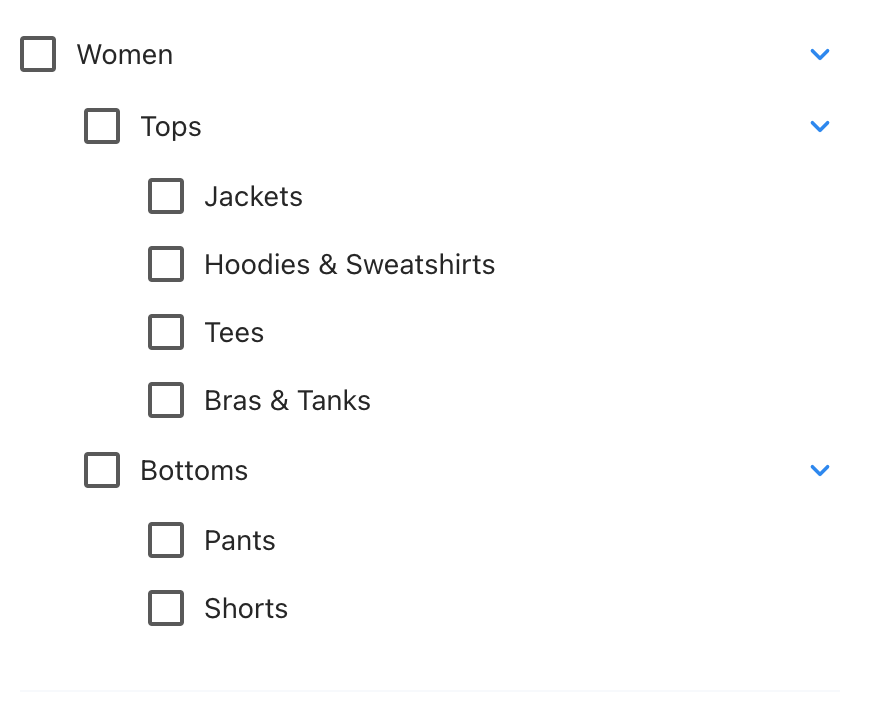

Our App is currently empty
Your goals are:

1. Add React router to this app, we will have 2 pages: `/ex1` and `/ex2`

======== EXCERCISE 1 ========

2. This is page `/ex1`

   We have these mock API

   - GET https://628e0d29a339dfef87a6ad21.mockapi.io/employees
     list of ALL employee with each employee structure like this:

     ```json
     {
      "id":"1"
      "name":"Harley",
      "email":"Emilia.Hauck@yahoo.com",
      "position":"Senior Accountability Technician",
      "avatar":"https://cloudflare-ipfs.com/ipfs/Qmd3W5DuhgHirLHGVixi6V76LhCkZUz6pnFt5AJBiyvHye/avatar/454.jpg"
     }
     ```

   - POST https://628e0d29a339dfef87a6ad21.mockapi.io/employees
     Add new employee by passing the same structure as above

- fetch all employees data
- render a table with 5 columns, each row has data of each employee
- At the end, add a button `"Add"` to open a popup that has a form to add new employee
- After new employee is added, refetch data

======== EXCERCISE 1 ========

1. This is page `/ex2`

- we have a JSON file name `ex2Data.json` that has this structure:

  ```
  {
    name: string
    children: {
      name: string
      children: {...}[]
    }[]
  }[]
  ```

- In summary, each item has a `name` and may have a list of `children` with the same structure
- You goal is to Render a checklist like this 
- Children will not be shown as default
- click on each row will check the box
- click on dropdown will show children

- Extra points:
  - If an item is selected and has children, select all of its children and grand-children recursively
  - If all children are selected, then auto select father
